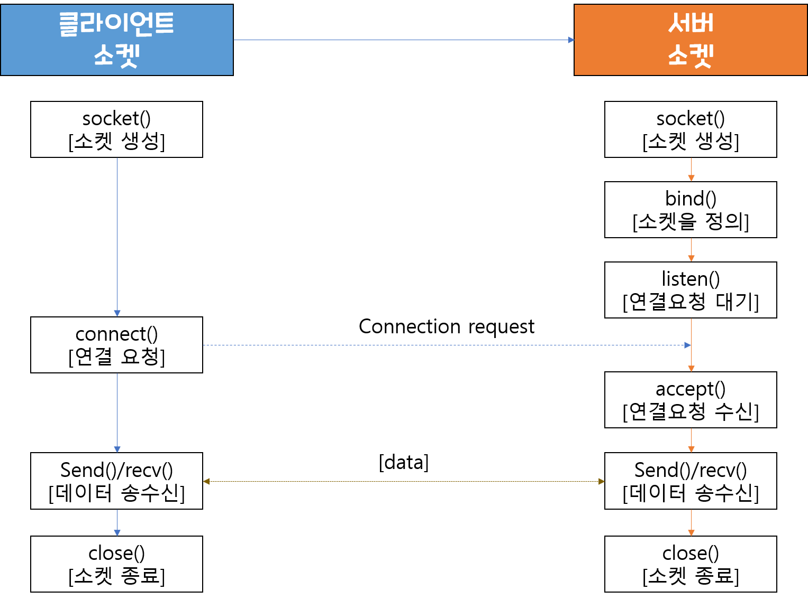
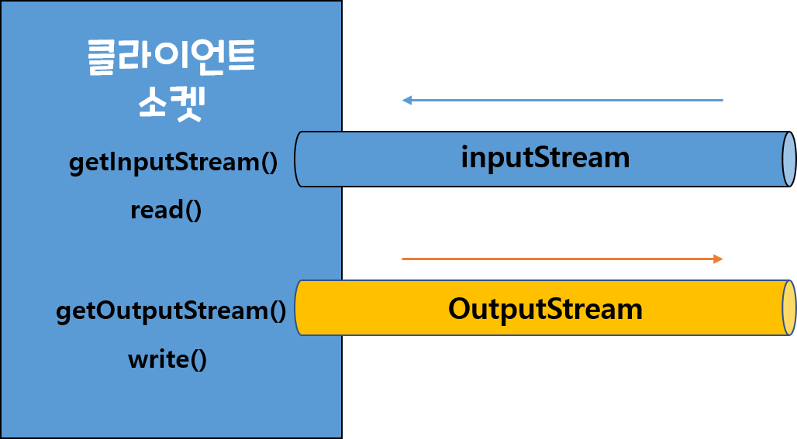

# Socket(소켓)
HTTP 요청방식을 알아보기전에 소켓에 대해 한번 짚어가면 좋다. 

## Socket 이란?
#### 사전적인 의미
벽의 콘센트, 혹은 (전기 기구에서 플로그 등을)꽂는 곳이라는 뜻으로, 어떤 걸 안전하게 연결시킬 때 필요한 부분이라고 해석할 수 가 있다.
<p align= center></p>

#### 통신에서의 소켓 의미
- 소프트웨어로 작성된 추상적인 개념의 통신 접속점이라 할 수 있다. 
- 네트워크 응용프로그램은 **소켓을 통하여 통신망으로 데이터를 송수신** 하게된다. 
- 프로세스 간의 통신에 사용되는 **양쪽 끝단**을 의미한다. 
- 프로세스가 네트워크를 통해 데이터를 송수신할 수 있는 창구이며, 떨어져 있는 두 호스트를 연결해주는 인터페이스 역할을 한다. 
- 즉,두 소켓이 연결되면 서로 다른 프로세스끼리 데이터를 전달할 수 있다.
    - 소켓이 구현됨으로써 네트워크 및 전송 계층의 캡슐화가 가능하다. (데이터에 헤더를 달아 보낼수 있다.)


## 소켓의 종류 
소켓은 상대방에게 데이터를 보내거나 받는 역할을 하며 연결을 수동적으로 기다리냐, 능동적으로 연결하느냐로 나뉜다.
TCP/IP 소켓 통신
 - 클라이언트 프로그램과 서버 프로그램은 각각 자신이 포트를 통해 통신해야 한다. 

- 연결할 때도 포트를  사용하고, 데이터를 교환할 때도 포트를 사용한다.
-자바 프로그램 안에서 포트를 사용하기 위해서는 소켓을 이용해야 한다. 
-자바 안에서 소켓의 종류는 서버 소켓과, 클라이언트 소켓이 있다.


#### 1. 서버 소켓
 - 서버 프로그램에서만 사용하는 소켓
 - 클라이언트로 부터 연결 요청이 오기를 기다렸다가 요결 요청이 들어오면 클라이언트와 연결을 맺고 
   다른 소켓을 만드는 일을 한다. 

#### 1-1. 사용방법
 ```
ServerSocket server = new ServerSocket(포트번호);

//클라이언트로 부터 연결 요청이 들어오면 연결을 맺고 클라이언트 소켓을 생성해 리턴한다.
Socket socket = server.accept();
```


#### 2. 클라이언트 소켓
 - 기다릴 필요가 없기 때문에 클라이언트 소켓을 생성한다.(우리가 프로그램 짤 때 쓰는 소켓이다.)
 - 클라이언트 프로그램에서 서버 프로그램으로 연결 요청을 하는 것과 데이터 전송하는 일을 한다. 

#### 2-1. 사용방법
```
Socket socket = new Socket(서버 아이피번호, 서버 포트번호); //서버포트에 맞춘다.
```

#### 3. 서버랑 클라이언트 간 데이터 전송 방법 

여기서 주의할 점은 클라이언트소켓과 서버 소켓은 구조가 다른, 전혀 별개의 소켓인 것처럼 여겨질 수 있다는 것이다.   
하지만, 두 소켓은 동일하다. 단지 역할과 구현 절차를 구분하기위해 다르게 부르는 것 뿐이다.   
   
   
<p align =center></p>

1.  먼저 서로 연결할 수 있는 서버와 클라이언트에 각각 소켓을 만듭니다.
2.  **서버 소켓**의 경우 bind() 즉, 소켓을 정의해주는 과정을 말하는데, 소켓의 경우 3가지로 인해 정의가 된다. 
    - IP주소, 포트넘버, 프로토콜
3. 다음 서버 소켓은 클라이언트 소켓의 연결요청이 올때까지 listen() 즉, 요청을 기다리는 상태가 됩니다.
4. **클라이언트 소켓**이 connect()함수를 이용하여, 서버소켓의 정의된 3가지 정보를 argument로 넣어 **서버 소켓**에 연결을 요청합니다.
5. **서버 소켓**이 연결요청된 정보가 맞으면 accept()로 연결을 수락합니다.
6. 연결이 완료된 **서버 소켓**과 **클라이언트 소켓**은 send()와 recv()를 통해 서로 데이터를 송수신합니다.
7. 서로 데이터를 주고받는 작업이 끝나고, 더이상 소켓이 필요없다면 서버,클라이언트 둘다 소켓을 close()로 닫아줍니다. 

<br></br>
그럼 위에 서버소켓에서의 "new ServerSocket(포트번호);"의 ServerSocket(포트번호) 이건 무엇일까요?   
위 그림의 1~7 과정은 기본적인 소켓의 process를 설명하기 위한 **C언어에서의 socket 통신 과정**을 설명한 내용이다.    
하지만, 필자는 Java에서의 socket을 다루기 때문에 ServerSocket()이 나온 것이다.   

## 자바(java)의 소켓
자바는 개발의 편의를 위해 기본적으로 여러 라이브러리를 제공해준다.    
그중 socket을 사용하는 경우도 마찬가지인데, **java.net 패키지에 포함되어 있어 API**를 사용해서 구현할 수가 있다.   

### 1. 소켓의 생성 (+연결요청)
자바는 편히를 위해    
역할이 다른 서버 소켓과 클라이언트 소켓의 API를 구분해놓았다.
그렇기 때문에, 클라이언트 소켓은 소켓을 생성하는 순간 연결 요청을 보낸다.   
(소켓의 기본 프로토콜은 True로  TCP로 되어있다.)
 - 클라이언트 소켓 생성

 ```
//그래서 생성할 때 연결요청에 필요한 정보도 입력한다.
Socket socket = new Socket(서버 아이피번호 혹은 URL, 서버 포트번호);

//아래와 같이 argument false를 추가하면 UDP 프로토콜로 생성이 된다. 
Socket socket = new Socket(서버 아이피번호 혹은 URL, 서버 포트번호, false);

```


  - 서버 소켓 생성
```
 ServerSocket server = new ServerSocket(포트번호);
```

### 2. 연결 수락
생성과 동시에 연결 요청을 하기 때문에 
서버 소켓은 바로 accept()함수로 요청 수락을 한다. 

```
server.accept();
```
### 3. 데이터를 주고 받을 스트림(Stream)생성
자바는 데이터를 주고받을때 데이터형태를 스트림 객체로 만들어 주고 받는다.    
그렇기 때문에 보낼 데이터를 담을 OutputStream 객체와    
받는 데이터를 담을 InputStream 객체를 만들어 줘야한다. 

<p align =center></p>


- 데이터 송신에 사용할 출력 스트림 객체
```
OutputStream output = socket.getOutputStream();
//byte[] date는 char[]혹은 int[]가 들어간다.
String date = "Hello";
output.write(date); //data 배열안에 값이 대입된다. 반환값은 void이다.
```

- 데이터 수신에 사용할 입력 스트림 객체
```
InputStream input = socket.getInputStream();
inputread = new InputStreamReader(input, "ASCII");
char[] buffer = new char[512];
int loop = 1;
while(loop>-1){
  loop = inputread.read(buffer); //값이 있으면 ASCII범위의 값을 int값으로 반환하고, 값이 없으면 -1을 반환한다. 
}

```


### 4. 연결종료
모든 데이터를 송수신을 마치면, 소켓을 종료해주어야 합니다. 
 - 만약 계속 연결되어있으면 자원을 낭비하는 것(트래픽 증가)
 물론, 사용 했던 stream(혹은 버퍼)도 close()함수를 사용하여 닫아줘야한다. 
 
 ```
 output.close();
 input.close();
 socket.close();
