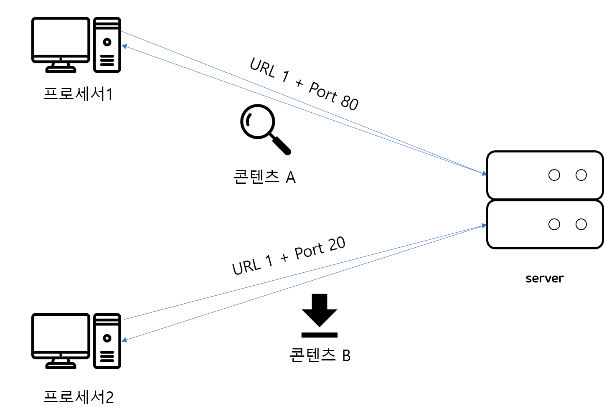
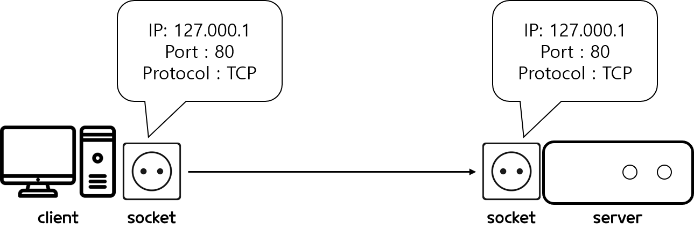
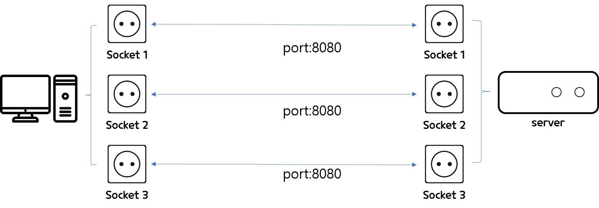

# 소켓과 포트의 차이
웹에 핵심인 네트워크 공부를 하다보니까,    
포트와 소켓이 생각보다 많이 언급이 되지만, 개념을 확실히 짚고간 적이 없어 애매모호한 상태였다.    
그래서 이번에 확실하게 짚고 넘어가고자 한다.    

## 포트 
 - 네트워크 상에서 통신하기 위해 호스트 내부적으로 프로세스 할당 받아야하는 고유한 숫자
 - 우편 번호 같은 것!
 - 데이터를 요청을 하는 호스트와 데이터를 전달하는 서버가 포트번호가 동일해야 서로 주고 받을 수 있음
     - 서버의 포트번호와 클라이언트의 포트번호가 같아야 통신이 가능하다.
 - URL(IP주소)가 같아도 Port번호가 다르면 다른 콘텐츠를 통신할 수 있다. 
   - 그러나, URL이 같아 쿠키값(저장된 값)을 공유할 우려가 있다.

## 소켓
- 프로세스가 네트워크를 통해서 데이터를 주고 받으려면 반드시 열어야하는 창구!
- 컴퓨터 세계관에서는 프로세스가 데이터를 보내고 싶다고 해서 막 보낼 수 있는게 아니다. 
- 보내는 쪽, 받는 쪽 모두 소켓을 열어야 한다.
- 소켓을 열기 위해선 호스트에 할당된 **IP주소, 포트 넘버, 프로토콜** 등이 필요하며, 이 세가지가 **소켓을 정의**한다. 

  

## 그럼 무엇이 다를까?
- 프로세스가 네트워크 통신을 하기 위해서는 **포트를 할당** 받아야 하는데, 서버의 경우에는 보통 **하나만 할당** 받는다. 
- 왜냐하면 같은 프로세스가 **같은 포트를 가지고도 여러 개의 소켓**을 열 수 있기 때문이다.
  - 이덕에 여럿이 동시에 접속하는 게임 같은 통신이 가능해진다.  
- 소켓을 정의하는 것과 소켓을 식별하는 것을 구분하자.
  - IP 주소, 포트 넘버, 프로토콜로 소켓을 정의할 수 있지만, 이것이 소켓을 유일하게 식별하진 않는다.

